## Index

 1. Shaders <!-- .element: class="fragment" data-fragment-index="1"-->
 2. Traslation, rotation, scaling and sheared --> 2d, nonlinear,.. <!-- .element: class="fragment" data-fragment-index="2" -->
 3. Homogeneous space <!-- .element: class="fragment" data-fragment-index="3" -->
 4.  Traslation, rotation(Euler), scaling and sheared --> 3d, linear,.. <!-- .element: class="fragment" data-fragment-index="4" -->
 5.  Orthogonal Matrix Rotations <!-- .element: class="fragment" data-fragment-index="5" -->
 6. Quaternion Rotations <!-- .element: class="fragment" data-fragment-index="6" -->
 7. Modeling Transformations <!-- .element: class="fragment" data-fragment-index="7" -->


## PIPELINE

<a href ="http://processing.org/tutorials/pshader/">
Shaders
</a>
In Processing
```
uniform mat4 transform;
attribute vec4 vertex;
attribute vec4 color;
varying vec4 vertColor;

void main(){
   gl_Position = transform * vertex;
   vertColor = color;
}
```
```
varying vec4 vertColor;

void main(){
  gl_FragColor = vertColor;
}
```


## Two-dimensional transformations 


## Two-dimensional transformations 

<font color="yellow"> Object Transformations vs Coordinate System Transformation</font>

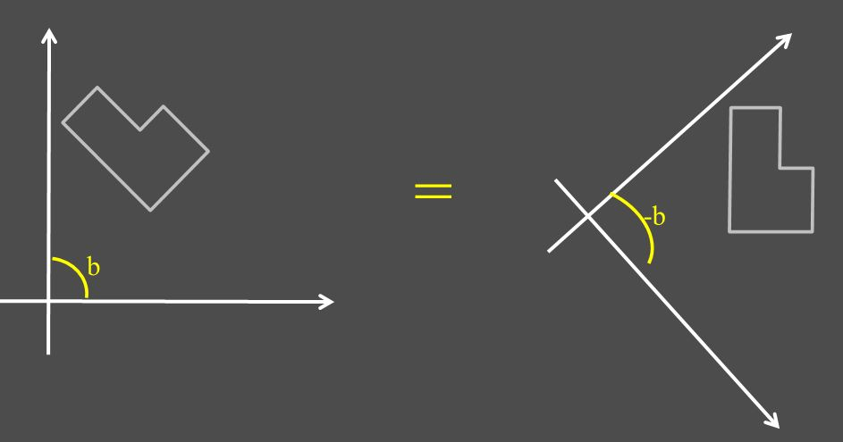


## Two-dimensional transformations

<font color="yellow"> Active Transformation (Standard Basis) vs Passive Transformation (change of base)</font>


## Two-dimensional transformations

<p align ="left"><font color="yellow">Traslation</font></p>

<p align ="right">Vectorially we get:</p>
</br>
<p align ="right"><p align ="botton"><font color="#00FFFF">
$\begin{bmatrix} 
x \cr 
y \end{bmatrix}
\begin{bmatrix} 
d_x \cr 
d_y \end{bmatrix}
\begin{bmatrix} 
x' \cr 
y' \end{bmatrix}$
</font></p></p>
</br>
<p align ="right"><p align ="botton"><font color="#01DF3A">
$
P'= P + T
$
</font></p></p>


## Two-dimensional transformations

<p align ="left"><font color="yellow">Scaling</font></p>

<p align ="right">Vectorially we get:</p>
</br>
<p align ="right"><p align ="botton"><font color="#00FFFF">
$\begin{bmatrix} 
x \cr 
y \end{bmatrix}
\begin{bmatrix} 
s_x & 0 \cr 
0 & s_y \end{bmatrix}
\begin{bmatrix} 
x' \cr 
y' \end{bmatrix}$
</font></p></p>
</br>
<p align ="right"><p align ="botton"><font color="#01DF3A">
$
P'= S * P
$
</font></p></p>


## Two-dimensional transformations

<p align ="left"><font color="yellow">Rotation</font></p>
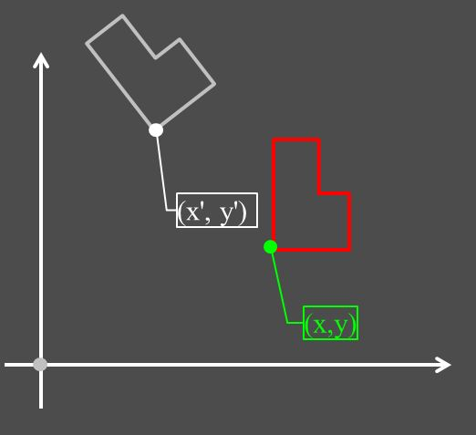


## Two-dimensional transformations
<table width="350" heigth="500" border="0" align ="right">
<tr>
<td>
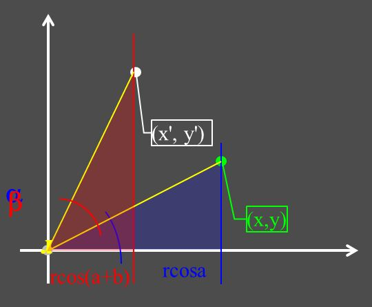
</td>
</tr>
<tr>
<td>
<font size ="5">Vectorially we get:</font>
</br>
<font size ="5" color="#00FFFF">
$\begin{bmatrix} 
x \cr 
y \end{bmatrix}
\begin{bmatrix} 
cos\beta & -sin \beta  \cr 
sin\beta & cos \beta \end{bmatrix}
\begin{bmatrix} 
x' \cr 
y' \end{bmatrix}$
</font>
</br>
<font size ="5" color="#01DF3A">
$
P'= R * P
$
</font>
</td>
</tr>
</table> 
<p align ="left"><font color="yellow">Rotation</font></p>
</font></p>
<p align ="left"><font size ="6">From the triangulation:</font></p>
<p align ="left"><font size ="6" color="blue">
$x = rcos \alpha$
</font></p>
<p align ="left"><font size ="6" color="blue">
$y= rsin \alpha$
</font></p>
<p align ="left"><font size ="5" color="red">
$x'= rcos (\alpha+\beta) = rcos \alpha cos \beta - rsin \alpha sin \beta $
</font></p>
<p align ="left"><font size ="5" color="red">
$y'= rsin (\alpha+\beta) = rcos \alpha sin \beta - rsin \alpha cos \beta $
</font></p>
<p align ="left"><font size ="6" color="#01DF3A">
$\boxed {x'= xcos \beta - ysin \beta}$
</font></p>
<p align ="left"><font size ="6" color="#01DF3A">
$\boxed {y'= xsin \beta + ycos \beta}$
</font></p>


## Two-dimensional transformations
<p align ="left"><font color="red">Rotation</font></p>
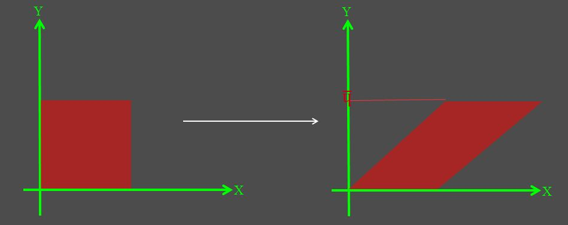
<p align ="left">We have </p>
$x' = x + h *y, y'=y$
<p align ="left">,where h is the sheared parameter, to obtain:</p>
<font size ="5" color="yellow">
$
D_x=\begin{bmatrix} 
1 & h \cr 
0 & 1 \end{bmatrix}
D_y=\begin{bmatrix} 
1 & 0 \cr 
h & 1 \end{bmatrix}
P'= {D_x \above 1.5pt D_y} * P
$
</font>


## Two-dimensional transformations

<table width="350" heigth="500" border="0" align ="right">
<tr>
<td>
<br/>
<br/>
<p><font size ="5" color="yellow">
$
T=\begin{bmatrix} 
d_x \cr 
d_y \end{bmatrix}
$
</font></p>
<br/>
<p><font size ="5" color="#00FFFF">
$
S=\begin{bmatrix} 
s_x & 0 \cr 
0 & s_y \end{bmatrix}
$
</font></p>
<br/>
<p><font size ="5">
$
R=\begin{bmatrix} 
cos\beta & -sin \beta  \cr 
sin \beta & cos \beta \end{bmatrix}
$
</font></p>
<br/>
<p><font size ="5" color="red">
$
D_x=\begin{bmatrix} 
1 & h \cr 
0 & 1 \end{bmatrix}
D_y=\begin{bmatrix} 
1 & 0 \cr 
h & 1 \end{bmatrix}
$
</font></p>
</td>
</tr>
</table> 

<p align ="left"><font color="blue">Trasformations Summary</font></p>
<p align ="left"><font color="yellow" size ="6">Traslation</font></p>
<p align ="left"><font size ="6" color="yellow">
$P' = P+T$
</font></p>
<p align ="left"><font color="#00FFFF"size ="6">Scaling</font></p>
<p align ="left"><font size ="6" color="#00FFFF">
$P' = S\ast P$
</font></p>
<p align ="left"><font size ="6">Rotation</font></p>
<p align ="left"><font size ="6">
$P' = R\ast P$
</font></p>
<p align ="left"><font color="red"size ="6">Sheared</font></p>
<p align ="left"><font size ="6" color="red">
$P'= {D_x \above 1.5pt D_y} * P$
</font></p>


## Types of Transformations 

<p align ="left"><font color="#00FFFF">1. Linear</font></p>
<p align ="left">
$
F(a+b)= F(a)+ F(b)
$
$
F(\lambda a) = \lambda F(a)\rightarrow F(0) = 0
$
, Thus is a nonlinear transformation
</p>
<p align ="center"><font color="yellow">Note:</font> Matrix multiplication is always linear</p>
<p align ="left"><font color="#00FFFF">2. Related</font></p>
<p align ="center">
Linear $+$ Traslation $\rightarrow p' = M\ast p + b $
</p>
<p align ="left"><font color="#00FFFF">3. Invertibles</font></p>
<p align ="center"> 
Lets take a look at <font color="red">$M^{-1}$ </font>, the inverse matrix of the general transformation matrix <font color="red">$M$</font>
</p>
$
P'= M\ast P,\space \space \space \space \space \space \space  M^{-1}P' = M^{-1}M P
$


## Homogeneous space
<table width="350" heigth="500" border="0" align ="left">
<tr>
<td>
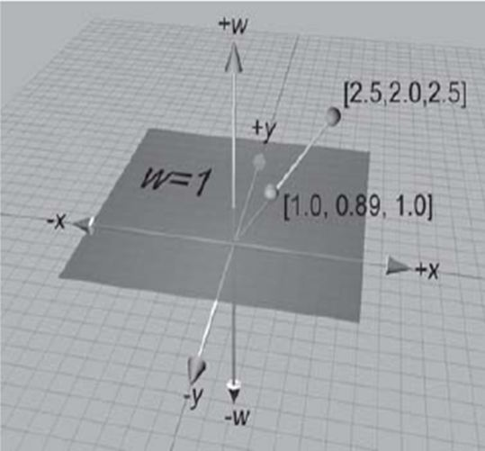
</td>
</tr>
</table>
<p><font color="#00FFFF">
Homogeneous coordinates</font></p>
$
(x,y,w)
$
<p>
2D Space $\rightarrow$ Homogeneous Space
</p>
<p>
$
(x,y) \rightarrow (x,y,1)
$
</p>
<p>
$
(\frac xw, \frac yw) \rightarrow (x,y,w)
$
</p>
<font color ="#868A08"><p>
3D Space $\rightarrow$ Homogeneous Space
</p>
<p>
$
(x,y,z) \rightarrow (x,y,z,1)
$
</p>
<p>
$
(\frac xw, \frac yw, \frac zw) \rightarrow (x,y,z,w)
$
</p>
</font>


## Summary 
<table width="350" heigth="500" border="0" align ="right">
<tr>
<td>
<br/>
<br/>
<p><font size ="4" color="yellow">
$
T=\begin{bmatrix} 
1 & 0 & d_x \cr
0 & 1 & d_y \cr 
0 & 0 & 1 \end{bmatrix}
$
</font></p>
<br/>
<p><font size ="4" color="#00FFFF">
$
S=\begin{bmatrix} 
s_x & 0 & 0 \cr
0 & s_y & 0 \cr 
0 & 0 & 1 \end{bmatrix}
$
</font></p>
<br/>
<p><font size ="4">
$
R=\begin{bmatrix} 
cos\beta & -sin \beta & 0  \cr 
sin \beta & cos \beta & 0  \cr
0 & 0 & 1\end{bmatrix}
$
</font></p>
<br/>
<p><font size ="4" color="red">
$
D_x=\begin{bmatrix} 
1 & h & 0\cr
0 & 1 & 0\cr 
0 & 0 & 1 \end{bmatrix}
D_y=\begin{bmatrix} 
1 & 0 & 0 \cr 
h & 1 & 0 \cr 
0 & 0 & 1\end{bmatrix}
$
</font></p>
</td>
</tr>
</table> 

<p align ="left"><font color="blue" size="4">
$
P'=\begin{bmatrix} 
x' \cr 
y' \cr 
1\end{bmatrix}
$
$
P=\begin{bmatrix} 
x \cr 
y \cr 
1\end{bmatrix}
$
</font></p>
<p align ="left"><font color="yellow" size ="5">Traslation</font></p>
<p align ="left"><font size ="5" color="yellow">
$P' = T(d_x,d_y)\ast P $
</font></p>
<p align ="left"><font color="#00FFFF"size ="5">Scaling</font></p>
<p align ="left"><font size ="5" color="#00FFFF">
$P' = T(s_x,s_y)\ast P$
</font></p>
<p align ="left"><font size ="5">Rotation</font></p>
<p align ="left"><font size ="5">
$P' = R(\beta)\ast P$
</font></p>
<p align ="left"><font color="red"size ="5">Sheared</font></p>
<p align ="left"><font size ="5" color="red">
$P'= {D_x \above 1.5pt D_y} * P$
</font></p>


##Homogeneous coordinates
<p align ="left"><font color="blue"> Observation about the inverse matrix of the transformation matrix</p></font>
<table width="650" heigth="500" border="0" align ="right">
<tr>
<td>
<p align ="left"><font size="4"> 
Lets take a look at <font color="red">$M^{-1}$ </font>, the inverse matrix of the general transformation matrix <font color="red">$M$</font></font>
</p>
</td>
</tr>
<tr>
<td>
<font size="4"> 
$
P'= M\ast P,\space \space \space \space \space \space \space  M^{-1}P' = M^{-1}M P
$
</font>
<p><font size="4">
$
M^{-1}P' = I \space \space \space P=P
$
</font></p>

<p><font size ="4" color="yellow">
$
T=\begin{bmatrix} 
1 & 0 & d_x \cr
0 & 1 & d_y \cr 
0 & 0 & 1 \end{bmatrix}
$

$
T^{-1}=\begin{bmatrix} 
1 & 0 & -d_x \cr
0 & 1 & -d_y \cr 
0 & 0 & 1 \end{bmatrix}
$
</font></p>
<br/>
<p><font size ="4" color="#00FFFF">
$
S=\begin{bmatrix} 
s_x & 0 & 0 \cr
0 & s_y & 0 \cr 
0 & 0 & 1 \end{bmatrix}
$
$
S^{-1}=\begin{bmatrix} 
\frac 1s_x & 0 & 0 \cr
0 & \frac 1s_y & 0 \cr 
0 & 0 & 1 \end{bmatrix}
$
</font></p>

</tr>
</td>
</table> 
<table width="310" heigth="500" border="0" align ="left">
<tr>
<td>
<br/> 
<p align ="left"><font color="blue" size="5">
$
P'=\begin{bmatrix}
x' \cr 
y' \cr 
1\end{bmatrix}
$
$
P=\begin{bmatrix} 
x \cr 
y \cr 
1\end{bmatrix}
$
</font></p>
<p align ="left"><font color="yellow" size ="5">Traslation</font></p>
<p align ="left"><font size ="5" color="yellow">
$P' = T(d_x,d_y)\ast P $
</font></p>
<p align ="left"><font color="#00FFFF" size ="5">Scaling</font></p>
<p align ="left"><font size ="5" color="#00FFFF">
$P' = T(s_x,s_y)\ast P $
</font></p>
</table> 


##Homogeneous coordinates
<p align ="left"><font color="blue"> Observation about the inverse matrix of the transformation matrix</p></font>
<p align ="left"><font color="green"> Rotation</p></font>
<font color="#00FFFF" size ="5">
$
P'= R(\beta)\ast P
\space
\space
\space
\space
\space
\space
$
$
R=\begin{bmatrix} 
cos\beta & -sin \beta & 0  \cr 
sin \beta & cos \beta & 0  \cr
0 & 0 & 1\end{bmatrix}
$
</font>
<br/>
<br/>
<font color="#00FFFF" size ="5">
$
R=\begin{bmatrix} 
cos (-\beta) & -sin (-\beta) & 0  \cr 
sin (-\beta) & cos (-\beta) & 0  \cr
0 & 0 & 1\end{bmatrix}
=\begin{bmatrix} 
cos\beta & sin \beta & 0  \cr 
-sin \beta & cos \beta & 0  \cr
0 & 0 & 1\end{bmatrix}
$
</font>


##Two-dimensional transformations Composition
<p align ="left"><font color="blue"> Successive transformations example</p></font>
<table width="100" heigth="500" border="0" align ="center">
<tr>
<td>
<font color="#2EFE2E" size ="6">
<div style="width:100px;height:50px;border:6px outset #2EFE2E;">
$P$
</div>
</font>
</td>
<td>
$\overrightarrow{\hspace7in}$
</td>
<td>
<font size ="6">
<div style="width:100px;height:50px;border:6px outset;">
$P'$
</div>
</font>
</tr>
</td>
</table>

<br/>

<table width="100" heigth="500" border="0" align ="center">
<tr>
<td>
<font color="yellow" size ="6">
<div style="width:150px;height:50px;border:6px outset yellow;">
Traslation
</div>
</font>
</td>
<td>
$\overrightarrow{\hspace1in}$
</td>
<td>
<font size ="6">
<div style="width:150px;height:50px;border:6px outset;">
Rotation
</div>
</font>
</td>
<td>
$\overrightarrow{\hspace1in}$
</td>
<td>
<font color="yellow" size ="6">
<div style="width:150px;height:50px;border:6px outset yellow;">
Traslation
</div>
</font>
</td>
<td>
$\overrightarrow{\hspace1in}$
</td>
</td>
<td>
<font color="#00FFFF" size ="6">
<div style="width:150px;height:50px;border:6px outset #00FFFF;">
Scaling
</div>
</font>
</td>
</tr>
</table>

<br/>

<table width="200" heigth="500" border="0" align ="center">
<tr>
<td>
<font color="yellow" size ="5">
<div style="width:150px;height:50px;border:6px outset yellow;">
$P_1 = T\ast P$
</div>
</font>
</td>
<td>
$\overrightarrow{\hspace0.5in}$
</td>
<td>
<font size ="5">
<div style="width:150px;height:50px;border:6px outset;">
$P_2 = R\ast P_1$
</div>
</font>
</td>
<td>
$\overrightarrow{\hspace0.5in}$
</td>
<td>
<font color="yellow" size ="5">
<div style="width:150px;height:50px;border:6px outset yellow;">
$P_3 = T'\ast P_2$
</div>
</font>
</td>
<td>
$\overrightarrow{\hspace0.5in}$
</td>
</td>
<td>
<font color="#00FFFF" size ="5">
<div style="width:150px;height:50px;border:6px outset #00FFFF;">
$P'= S\ast P_3$
</div>
</font>
</td>
</tr>
</table>

<br/>

<font color="orange" size ="5">
<div style="width:300px;height:50px;border:6px outset orange;">
$P'= S\ast T'\ast R\ast T\ast P$
</div>
</font>


##Two-dimensional transformations Composition
<p><font color="blue">Some special compositions</font></p>
<p><font color="yellow">Rotation from pivot point</font></p>


##Two-dimensional transformations Composition
<p><font color="blue">Some special compositions</font></p>
<p><font color="yellow">Rotation from pivot point</font></p>
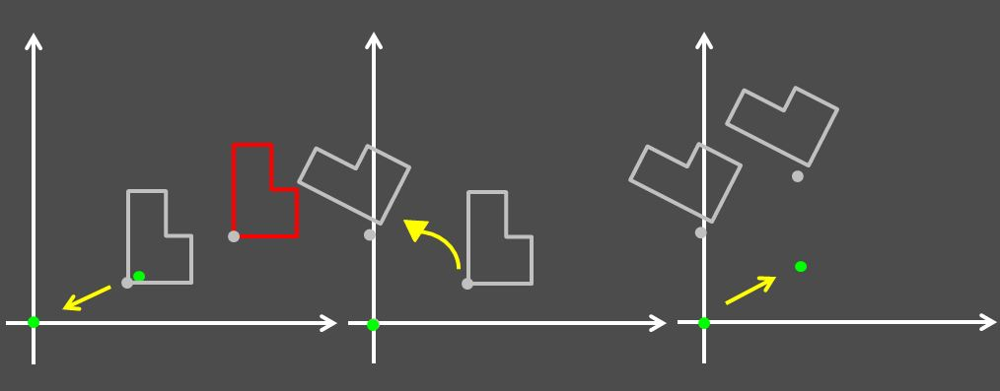


##Two-dimensional transformations Composition
<p><font color="blue">Some special compositions</font></p>
<p><font color="yellow">Rotation from pivot point</font></p>
<br/>
<font color="yellow" size ="5">
$
\begin{bmatrix} 
1 & 0 & x_r  \cr 
0 & 1 & y_r  \cr
0 & 0 & 1\end{bmatrix}
$
</font>
$
\bullet
$
<font size ="5">
$
\begin{bmatrix} 
cos\beta & -sin\beta & 0  \cr 
sin\beta & cos\beta & 0  \cr
0 & 0 & 1\end{bmatrix}
$
</font>
$
\bullet
$
<font color="yellow" size ="5">
$
\begin{bmatrix} 
1 & 0 & -x_r  \cr 
0 & 1 & -y_r  \cr
0 & 0 & 1\end{bmatrix}
$
</font>

<br/>

<font color="#2EFE2E" size ="5">
$
=\begin{bmatrix} 
cos\beta & -sin\beta & x_r(1-cos\beta)+y_rsin\beta  \cr 
sin\beta & cos\beta & y_r(1-cos\beta)-x_rsin\beta  \cr
0 & 0 & 1\end{bmatrix}$
</font>


##Two-dimensional transformations Composition
<p><font color="blue">Some special compositions</font></p>
<p><font color="yellow">Scaling from static point</font></p>


##Two-dimensional transformations Composition
<p><font color="blue">Some special compositions</font></p>
<p><font color="yellow">Scaling from static point</font></p>
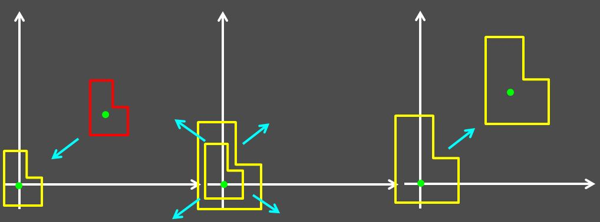


##Two-dimensional transformations Composition
<p><font color="blue">Some special compositions</font></p>
<p><font color="yellow">Scaling from static point</font></p>
<br/>
<font color="yellow" size ="5">
$
\begin{bmatrix} 
1 & 0 & x_f  \cr 
0 & 1 & y_f  \cr
0 & 0 & 1\end{bmatrix}
$
</font>
$
\bullet
$
<font color="#00FFFF" size ="5">
$
\begin{bmatrix} 
s_x & 0 & 0  \cr 
0 & s_y & 0  \cr
0 & 0 & 1\end{bmatrix}
$
</font>
$
\bullet
$
<font color="yellow" size ="5">
$
\begin{bmatrix} 
1 & 0 & -x_f  \cr 
0 & 1 & -y_f  \cr
0 & 0 & 1\end{bmatrix}
$
</font>

<br/>

<font color="#2EFE2E" size ="5">
$
=\begin{bmatrix} 
s_x & 0 & x_f(1-s_x)  \cr 
0 & s_y & y_f(1-s_y)  \cr
0 & 0 & 1\end{bmatrix}$
</font>


## Two-dimensional transformations Composition
<p align ="left"><font color="blue">Some special compositions</font></p>
<p align ="left"><font color="yellow">General directions to scaling</font></p>
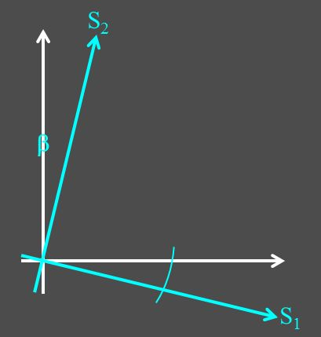
<p align ="right"><p align ="justify">
1. The object is rotated to angle <font color="#00FFFF">$\beta$</font>, so the directions <font color="#00FFFF">$s_1$</font> y <font color="#00FFFF">$s_2$</font> match with the axes.
</p></p>
</br>
<p align ="right"><p align ="justify">
2. <font color="#00FFFF">Scale</font> the object
</p></p>
<br/>
<p align ="right"><p align ="justify">
3. The object is rotated on the opposite way.
</p></p>


## Two-dimensional transformations Composition
<p align ="left"><font color="blue">Some special compositions</font></p>
<p align ="left"><font color="yellow">General directions to scaling</font></p>
<br/>
<font color="#2EFE2E" size ="6">
$
\begin{bmatrix} 
s_1 cos^2\beta + s_2 sin^2\beta & (s_2-s_1)cos\beta sin\beta & 0  \cr 
(s_2-s_1)cos\beta sin\beta & s_1 sin^2\beta + s_2 cos^2\beta & 0  \cr
0 & 0 & 1\end{bmatrix}$
</font>


## Traslations


## Traslations
<p align ="left"><font color="yellow">Specification</font></p>
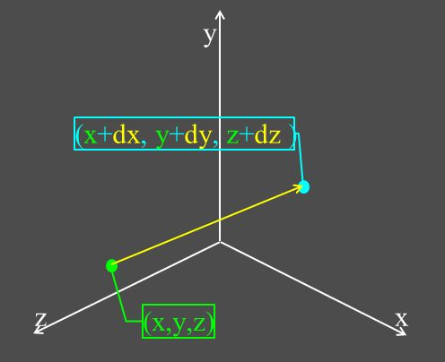
<p align ="left"><font size="5">Vectorially we get:</font></p>
<p align ="right"><p align ="botton"><font color="#2EFE2E" size ="5">
$\begin{bmatrix} 
x \cr
y \cr 
z \end{bmatrix}
$
</font>
<font color="yellow" size ="5">
$\begin{bmatrix} 
d_x \cr
d_y \cr 
d_z \end{bmatrix}
$
</font>
<font color="#00FFFF" size ="5">
$\begin{bmatrix} 
x' \cr
y' \cr 
z' \end{bmatrix}$
</font></p></p>
<p align ="right"><p align ="botton">
<font color="#00FFFF" size ="5">$P'$</font>= <font color="yellow" size ="5">$P$</font> +<font color="#2EFE2E" size ="5"> $T$</font>
</p></p>
<p align ="left"><font size="5">In homogeneous coordinates we get:</font></p>
<p align ="right"><p align ="botton"><font color="#2EFE2E" size ="5">
$\begin{bmatrix} 
x \cr
y \cr
z \cr 
1 \end{bmatrix}
$
</font>
<font color="yellow" size ="5">
$
\begin{bmatrix} 
1 & 0 & 0 & d_x \cr
0 & 1 & 0 & d_y \cr
0 & 0 & 1 & d_z \cr 
0 & 0 & 0 & 1 \end{bmatrix}
$
</font>
<font color="#00FFFF" size ="5">
$
\begin{bmatrix} 
x' \cr
y' \cr
z' \cr 
1 \end{bmatrix}$
</font></p></p>
<p align ="right"><p align ="botton">
<font color="#00FFFF" size ="5">$P'$</font>= <font color="yellow" size ="5">$T$</font>$\ast$<font color="#2EFE2E" size ="5"> $P$</font>
</p></p>


##Scaling


## Scaling
<p align ="left"><font color="yellow">Specification</font></p>
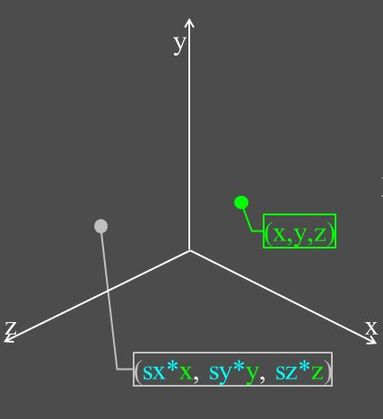
<p align ="left"><font size="5">Vectorially we get:</font></p>
<p align ="right"><p align ="botton"><font color="#2EFE2E" size ="5">
$\begin{bmatrix} 
x \cr
y \cr 
z \end{bmatrix}
$
</font>
<font color="#00FFFF" size ="5">
$\begin{bmatrix} 
s_x & 0 & 0 \cr
0 & s_y & 0 \cr 
0 & 0 & s_z \end{bmatrix}
$
</font>
<font size ="5">
$\begin{bmatrix} 
x' \cr
y' \cr 
z' \end{bmatrix}$
</font></p></p>
<p align ="right"><p align ="botton">
<font size ="5">$P'$</font>= <font color="#00FFFF" size ="5">$S$</font>$\ast$<font color="#2EFE2E" size ="5"> $P$</font>
</p></p>
<p align ="left"><font size="5">In homogeneous coordinates we get:</font></p>
<p align ="right"><p align ="botton"><font color="#2EFE2E" size ="5">
$\begin{bmatrix} 
x \cr
y \cr
z \cr 
1 \end{bmatrix}
$
</font>
<font color="#00FFFF" size ="5">
$
\begin{bmatrix} 
s_x & 0 & 0 & 0 \cr
0 & s_y & 0 & 0 \cr
0 & 0 & s_z & 0 \cr 
0 & 0 & 0 & 1 \end{bmatrix}
$
</font>
<font size ="5">
$
\begin{bmatrix} 
x' \cr
y' \cr
z' \cr 
1 \end{bmatrix}$
</font></p></p>
<p align ="right"><p align ="botton">
<font size ="5">$P'$</font>= <font color="#00FFFF" size ="5">$S$</font>$\ast$<font color="#2EFE2E" size ="5"> $P$</font>
</p></p>


## Rotations
<p align ="left"><font color="yellow">Parameters used in rotations</font></p>
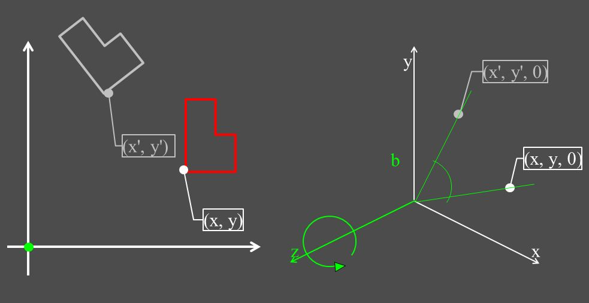


## Rotations
<p align ="left">Rotation respect z-axis</p>
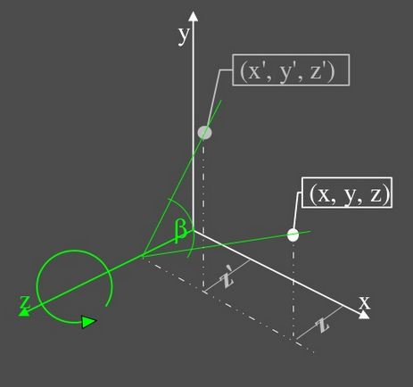
<p align ="left"><font size="5">Notice $z=z'$, we get:</font></p>
<p align ="right"><p align ="botton">
<p>$ x' = x cos \beta -y sin \beta$</p>
<p>$ y' = x sin \beta +y cos \beta$</p>
<p>$ z'= z$</p>
</p></p>
<p align ="left"><font size="5">In homogeneous coordinates we get:</font></p>
<p align ="right"><p align ="botton"><font size ="5">
$\begin{bmatrix} 
x \cr
y \cr
z \cr 
1 \end{bmatrix}
$
</font>
<font size ="5">
$
\begin{bmatrix} 
cos \beta & -sin \beta & 0 & 0 \cr
sin \beta & cos \beta & 0 & 0 \cr
0 & 0 & 1 & 0 \cr 
0 & 0 & 0 & 1 \end{bmatrix}
$
</font>
<font size ="5">
$
\begin{bmatrix} 
x' \cr
y' \cr
z' \cr 
1 \end{bmatrix}$
</font></p></p>
<p align ="right"><p align ="botton">
$P' = R \ast P$
</p></p>


## Rotations
<p align ="left">Rotation respect x-axis</p>

<p align ="left"><font size="5">Doing $y \rightarrow z \rightarrow x \rightarrow y$</font></p>
<p align ="left"><font size="5">In homogeneous coordinates we get:</font></p>
<p align ="right"><p align ="botton"><font size ="5">
$\begin{bmatrix} 
x \cr
y \cr
z \cr 
1 \end{bmatrix}
$
</font>
<font size ="5">
$
\begin{bmatrix} 
1 & 0 & 0 & 0 \cr
0 & cos \beta & -sin \beta & 0 \cr
0 & sin\beta & cos\beta & 0 \cr 
0 & 0 & 0 & 1 \end{bmatrix}
$
</font>
<font size ="5">
$
\begin{bmatrix} 
x' \cr
y' \cr
z' \cr 
1 \end{bmatrix}$
</font></p></p>
<p align ="right"><p align ="botton">
$P' = R \ast P$
</p></p>


## Rotations
<p align ="left">Rotation respect y-axis</p>
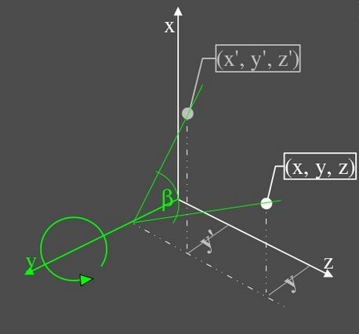
<p align ="left"><font size="5">Doing $y \rightarrow z \rightarrow x \rightarrow y$</font></p>
<p align ="left"><font size="5">In homogeneous coordinates we get:</font></p>
<p align ="right"><p align ="botton"><font size ="5">
$\begin{bmatrix} 
x \cr
y \cr
z \cr 
1 \end{bmatrix}
$
</font>
<font size ="5">
$
\begin{bmatrix} 
cos\beta & 0 & sen\beta & 0 \cr
0 & 1 & 0 & 0 \cr
-sin\beta & 0 & cos\beta & 0 \cr 
0 & 0 & 0 & 1 \end{bmatrix}
$
</font>
<font size ="5">
$
\begin{bmatrix} 
x' \cr
y' \cr
z' \cr 
1 \end{bmatrix}$
</font></p></p>
<p align ="right"><p align ="botton">
$P' = R \ast P$
</p></p>


## Rotations
<p align ="left">General Rotations</p>
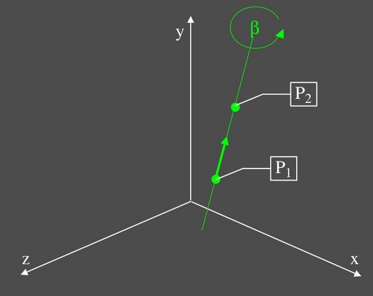


## Rotations
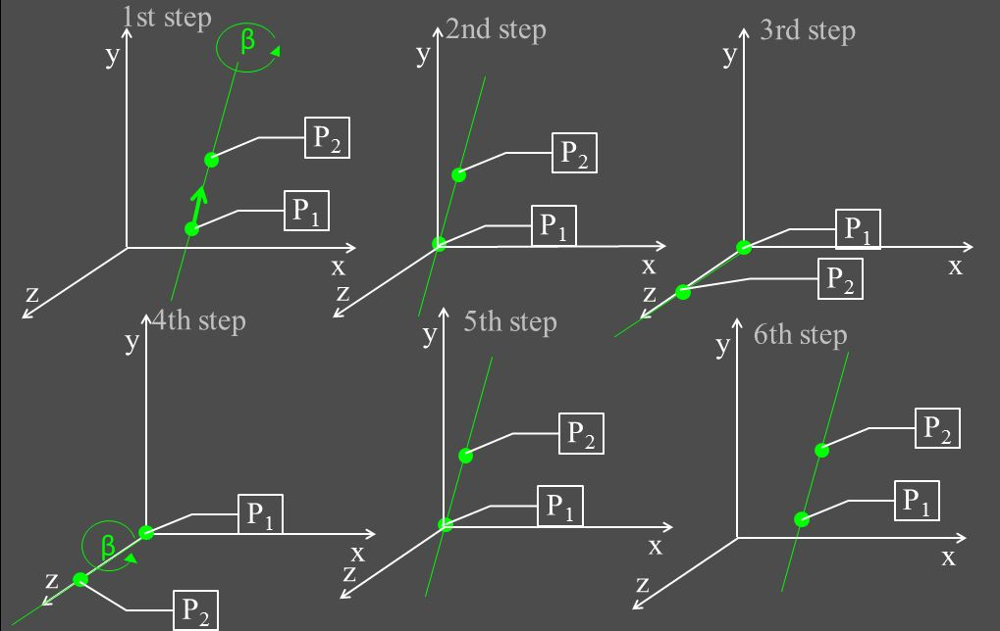


## Rotations
<p align ="left">1st step. Rotation parameter specifications</p>
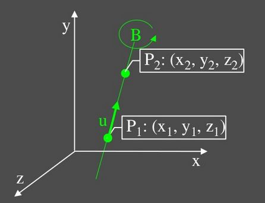
<p>
$ 
V = P_2 - P_1
$
</p>
<p><font color= "#2EFE2E">$u$</font>$=$ $V\above 1pt |V|$ $=$<font color= "#2EFE2E">$(a,b,c)$</font></p>

<p><font color= "#2EFE2E">$a$</font>$=$ $(x_2-x_1)\above 1pt |V|$</p>
<p><font color= "#2EFE2E">$b$</font>$=$ $(y_2-y_1)\above 1pt |V|$</p>
<p><font color= "#2EFE2E">$a$</font>$=$ $(z_2-z_1)\above 1pt |V|$</p>


## Rotations
<p align ="left">2nd step. Translation from $P_1$ to origin</p>
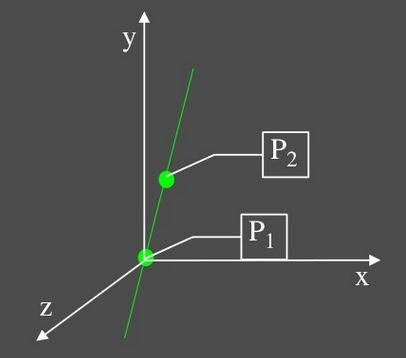
</br>
<p><font color = "yellow">
$T=\begin{bmatrix} 
1 & 0 & 0 & -x_1  \cr
0 & 1 & 0 & -y_1 \cr
0 & 0 & 1 & -z_1 \cr 
0 & 0 & 0 & 1 \end{bmatrix}
$
</font>
</p>


## Rotations
<p align ="left">3rd step. Turn of $P_2$ in z-axis</p>
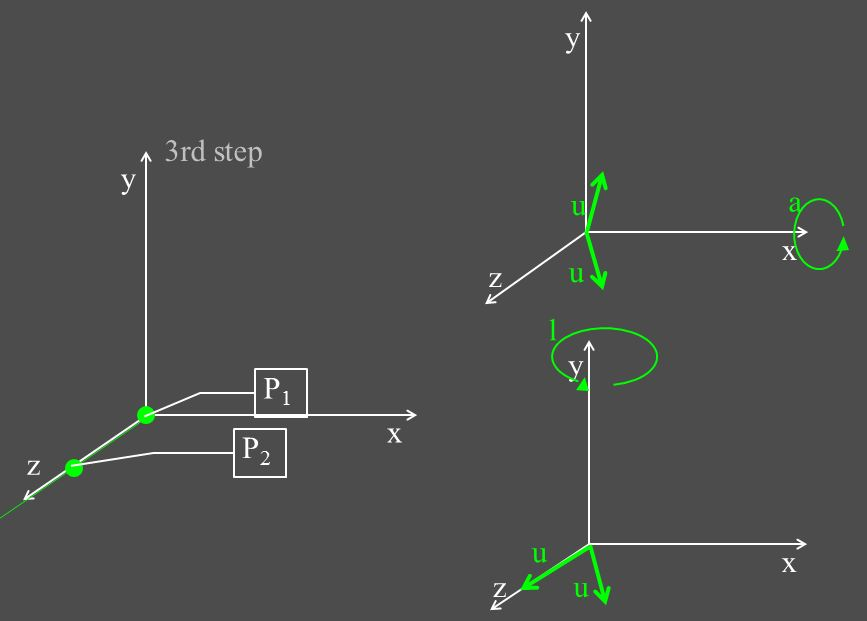


## Rotations
<table width="350" heigth="500" border="0" align ="left">
<tr>
<td>
<p align ="left">3rd step</p>
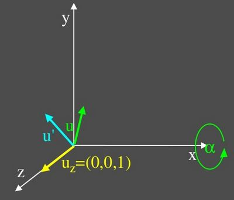
</td>
</tr>
<tr>
<td>
</br>
<font size ="5">
$R_x(\alpha)=\begin{bmatrix} 
1 & 0 & 0 & 0  \cr
0 & \frac cd & -\frac bd & 0 \cr
0 & \frac bd & \frac cd & 0 \cr 
0 & 0 & 0 & 1 \end{bmatrix}
$ 
</font>
</td>
</tr>
</table> 
<p align ="left"><font size ="5">We get:</font></p>
<p align ="left"><font size ="5" color="#2EFE2E">$u$</font>$=$<font size ="5" color="#2EFE2E"> $(a,b,c)$</font>. <font size ="5">From u projection in y-z plane:</font></p>
<p align ="left"><font size ="5" color="#00FFFF">$u'$</font>$=$<font size ="5" color="#00FFFF"> $(0,b,c)$</font>. <font size ="5"><font size ="5" color="#2EFE2E">$\alpha$</font> is the angle between<font color="#00FFFF"> $u'$ </font> y <font size ="5" color="yellow"> $u_z$</font>$\rightarrow$</font></p>

<p align ="left"><font size="5">$cos$ </font><font color= "#2EFE2E" size="5">$\alpha$</font><font size="5">$=$</font><font size="5">$(u'\bullet u_z)\above 1pt (|u'||u_z|)$</font><font size="5">$=$</font><font size="5" color="#2EFE2E">$\frac cd$</font></p>

<p align ="left"><font size="5">where</font><font color= "#2EFE2E" size="5">$d$</font><font size="5">$=$</font><font size="5">$\sqrt{b^2+c^2}$</font><font size="5">$=$</font><font size="5" color="#00FFFF">$|u'|$</font>,</p>

<p align ="left"><font size ="5">Finally from cross product:</font></p>
<p align ="left"><font size ="5">1.<font color="#00FFFF">$u'$</font>x<font color="yellow">$u_z$</font>$= u_x$<font color="#00FFFF">$|u'|$</font><font color="yellow">$|u_z|$</font>$sin$<font color="#2EFE2E">$\alpha$</font> (Idempotent form) y </font></p>
<p align ="left"><font size ="5">2.<font color="#00FFFF">$u'$</font>x<font color="yellow">$u_z$</font>$= u_x$<font color="#2EFE2E">$b$</font> (cartesian from) </font></p>
<p align ="left"><font size ="5">Thus:</font></p>
<p align ="left"><font size ="5">$sin$<font color="#2EFE2E">$\alpha$</font>$=$<font color="#2EFE2E">$\frac bd$</font></font></p>


## Rotations
<table width="350" heigth="500" border="0" align ="left">
<tr>
<td>
<p align ="left">3rd step</p>
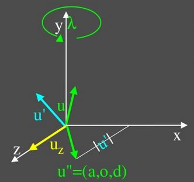
</td>
</tr>
<tr>
<td>
</br>
<font size ="5">
$R_y(\lambda)=\begin{bmatrix} 
d & 0 & -a & 0  \cr
0 & 1 & 0 & 0 \cr
a & 0 & d & 0 \cr 
0 & 0 & 0 & 1 \end{bmatrix}
$ 
</font>
</td>
</tr>
</table> 
<p align ="left"><font size ="5">We get:</font></p>
<p align ="left"><font size ="5" color="#2EFE2E">$u$</font><font size ="5">$=$</font><font size ="5" color="#2EFE2E"> $(a,b,c)$</font>. <font size ="5">From u projection in y-z plane:</font></p>

<p align ="left"><font size ="5" color="#00FFFF">$u'$</font><font size ="5">$=$</font><font size ="5" color="#00FFFF"> $(0,b,c)$</font>.</p>

<p align ="left"><font size ="5">From u rotation respect x-axis we get:</font></p>

<p align ="left"><font size ="5" color="#2EFE2E">$u''$</font><font size ="5">$=$</font><font size ="5" color="#2EFE2E"> $(a,0,d\space)$</font><font size ="5">with$\space$ <font size="5" color="#2EFE2E">$d =\sqrt{b^2+c^2}\space$</font>($u'$ magnitude)</font></p>

<p align ="left"><font size ="5" color="#2EFE2E">$\lambda$</font><font size ="5"> is the angle between</font><font color="#00FFFF" size="5"> $u''$ </font><font size ="5"> y </font><font size ="5" color="yellow"> $u_z$</font>$\rightarrow$</font></p>

<p align ="left"><font size="5">$cos$ </font><font color= "#2EFE2E" size="5">$\lambda$</font><font size="5">$=$</font><font size="5">$(u''\bullet u_z)\above 1pt (|u''||u_z|)$</font><font size="5">$=$</font><font size="5" color="#2EFE2E">$d,$</font><font size ="5">since</font><font color= "#2EFE2E" size="5">$|u''|$</font><font size ="5">$=$</font><font color= "yellow" size="5">$|u_z|$</font><font size ="5">$=$</font><font size ="5">$1$</font></p>

<p align ="left"><font size ="5">Finally from cross product:</font></p>

<p align ="left"><font size ="5">1.<font color="#2EFE2E">$u''$</font>x<font color="yellow">$u_z$</font>$= u_y$<font color="#2EFE2E">$|u''|$</font><font color="yellow">$|u_z|$</font>$sin$<font color="#2EFE2E">$\lambda$</font> (Idempotent form) y </font></p>

<p align ="left"><font size ="5">2.<font color="#2EFE2E">$u''$</font>x<font color="yellow">$u_z$</font>$= u_y$<font color="#2EFE2E">$(-a)$</font> (cartesian from) </font></p>

<p align ="left"><font size ="5">Thus:</font>
<font size ="5">$sin$<font color="#2EFE2E">$\lambda$</font>$=$<font color="#2EFE2E">$-a$</font></font></p>


##Rotations
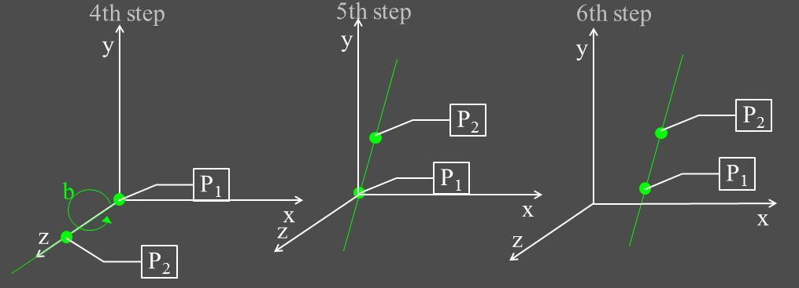
<p align ="center"><font size ="5">
$R_z(\beta)=\begin{bmatrix} 
cos \beta & -sin \beta & 0 & 0  \cr
sin  \beta & cos \beta & 0 & 0 \cr
0 & 0 & 1 & 0 \cr 
0 & 0 & 0 & 1 \end{bmatrix}
$ 
$R_x$<font color="#2EFE2E">$(\alpha)^{-1}$</font>$\bullet R_y$<font color="#2EFE2E">$(\lambda)^{-1}$</font><font color="yellow">$T^{-1}$</font>
</font>
</p>
</br>
<font size ="5">
<div style="width:700px;height:50px;border:6px outset red;">
$R(\beta)=$<font color="yellow">$T^{-1}$</font>$\bullet R_x$<font color="#2EFE2E">$(\alpha)^{-1}$</font>$\bullet R_y$<font color="#2EFE2E">$(\lambda)^{-1}$</font>$\bullet R_z$<font color="#2EFE2E">$(\beta)$</font>$\bullet R_y$<font color="#2EFE2E">$(\lambda)$</font>$\bullet R_x$<font color="#2EFE2E">$(\alpha)$</font><font color="yellow">$\bullet T$</font>
</div>
</font>


##Rotations
<p align ="left">Another way to calculate the composite transformation matrix:</p>
<p align ="left">$R_y$<font color="#2EFE2E">$(\lambda)$</font>$\bullet R_x$<font color="#2EFE2E">$(\alpha)$</font></p>
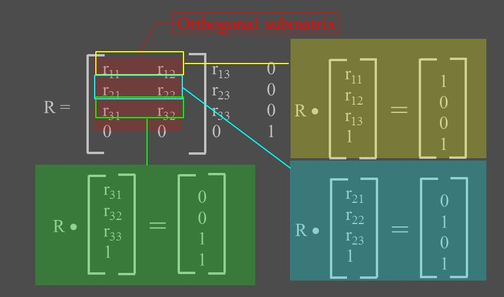


##Rotations
<p align ="left">Another way to calculate the composite transformation matrix:</p>
<p align ="left">$R_y$<font color="#2EFE2E">$(\lambda)$</font>$\bullet R_x$<font color="#2EFE2E">$(\alpha)$</font></p>
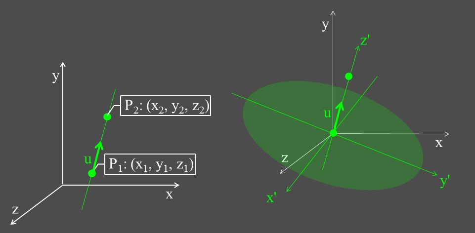

<font size ="5">
<div style="width:400px;height:180px;border:6px outset">
<table width="350" heigth="500" border="0" align ="left">
<tr>
<td>
<p>$ V = P_2 - P_1$</p>
<p><font color="#2EFE2E">$u$</font>$=$$V \above 1pt |V|$$=$<font color="#2EFE2E">$(a,b,c)$</font></p>
<p><font color="#2EFE2E">$a$</font>$=$$(x_2-x_1) \above 1pt |V|$</p>
</td>
<td>
<p><font color="#2EFE2E">$b$</font>$=$$(y_2-y_1) \above 1pt |V|$</p>
<p><font color="#2EFE2E">$c$</font>$=$$(z_2-z_1) \above 1pt |V|$</p>
</td>
</tr>
</table>
</div>
</font>


##Rotations
<p align ="left"><font size ="5">Another way to calculate the composite transformation matrix:</font></p>
<p align ="left"><font size ="5">$R_y$<font color="#2EFE2E">$(\lambda)$</font>$\bullet R_x$<font color="#2EFE2E">$(\alpha)$</font></font></p>
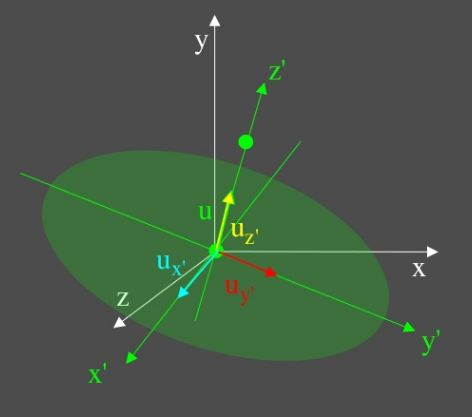
<font size ="5">
<div style="width:400px;height:200px;border:6px outset">
<p align ="left"><font color="#2EFE2E">$u$</font>$=$$V \above 1pt |V|$$=$<font color="#2EFE2E">$(a,b,c)$</font></p>
<p align ="left"><font color="yellow">$u_z'$</font>$=$<font color="#2EFE2E">$u$</font>($z'$-axis aligns with z)</p>
<p align ="left"><font color="blue">$u_x'$</font>$=$any unit vector(in the orthogonal plane to<font color="yellow">$\space u_z'$</font>)</p>
<p align ="left"><font color="red">$u_y'$</font>$=$<font color="#2EFE2E">$u \space$</font>x<font color="#00FFFF">$\space u_x'$</font></p>
</div>
</font>

<font size ="5">
<div style="width:400px;height:120px;border:6px outset">
<p align ="left"><font color="#00FFFF">$u_x'$</font>$=$(<font color="#00FFFF">$u_x'1,u_x'2,u_x'3$</font>)</p>
<p align ="left"><font color="red">$u_y'$</font>$=$(<font color="red">$u_y'1,u_y'2,u_y'3$</font>)</p>
<p align ="left"><font color="yellow">$u_x'$</font>$=$(<font color="yellow">$u_z'1,u_z'2,u_z'3$</font>)</p>
</div>
</font>

<font size = 5>
$R=\begin{bmatrix} 
u_x'1 & u_x'2 & u_x'3 & 0  \cr
u_y'1 & u_y'2 & u_y'3 & 0 \cr
u_z'1 & u_z'1 & u_z'1 & 0 \cr 
0 & 0 & 0 & 1 \end{bmatrix}
$ 
</font>


##Rotations
<p align ="left"><font size ="6">Rotations and Quaternions - Review</font></p>

<font size ="6">
<div style="width:900px;height:400px;border:6px outset">
<p align ="left"><font color="#2EFE2E">Concept: $\space q$</font>$= s +$<font color="red">$i$</font>$a+$<font color="yellow">$j$</font>$b+$<font color="#00FFFF">$k$</font>$c$</p>

<p align ="left">The coefficients $a, b$ and $c$, in the imaginary terms <font color="red">$i$</font>,<font color="yellow">$j$</font> and <font color="#00FFFF">$k$</font>, are real.</p>

<p align ="left">$S$ parameter is a real number known as scalar part.</p>

<p><font color="red">$i^2$</font>$=$<font color="yellow">$j^2$</font>$=$<font color="#00FFFF">$k^2$</font>$=-1$<font color="red">$\space\space\space\space i$</font><font color="yellow">$j$</font>$=$<font color="yellow">$-j$</font><font color="red">$i$</font>$=$<font color="#00FFFF">$k$</font>(Definition)</p>

<p><font color="yellow">$j$</font><font color="#00FFFF">$k$</font>$=$<font color="#00FFFF">$-k$</font><font color="yellow">$j$</font>$=$<font color="red">$i$</font><font color="#00FFFF">$\space\space\space\space\space\space\space\space\space k$</font><font color="red">$i$</font>$=$<font color="red">$-i$</font><font color="#00FFFF">$k$</font>$=$<font color="yellow">$j$</font>(Derived)</p>

<p align ="left"><font color="#2EFE2E">Sum $(q_1,q_2)$: $\space q_1,q_2$</font>$= (s_1+s_2) +$<font color="red">$i$</font>$(a_1+a_2)+$<font color="yellow">$j$</font>$(b_1+b_2)+$<font color="#00FFFF">$k$</font>$(c_1+c_2)$</p>

<p align ="left"><font color="#2EFE2E">Scalar Multiplication $(d)$: $\space dq$</font>$= (ds) +$<font color="red">$i$</font>$(da)+$<font color="yellow">$j$</font>$(db)+$<font color="#00FFFF">$k$</font>$(dc)$</p>

</div>
</font>


##Rotations
<p align ="left"><font size ="6">Rotations and Quaternions - Review</font></p>

<font size ="6">
<div style="width:1000px;height:400px;border:6px outset">
<p align ="left"><font color="#2EFE2E">Vectorial Notation: $\space q$</font>$=(s,$<font color="#00FFFF">$v$</font>)$\space$ where<font color="#00FFFF">$\space v=$</font>$(a,b,c)$</p>

<p align ="left"><font color="#2EFE2E">Product$(q_1,q_2)$: $\space q_1q_2$</font>$=(s_1s_2-$<font color="#00FFFF">$v_1\bullet v_2,$</font>$s_1$<font color="#00FFFF">$v_2$</font>$+s_2$<font color="#00FFFF">$v_1$</font>$+$<font color="#00FFFF">$v_1$</font>x<font color="#00FFFF">$v_2$</font>)</p>

<p align ="left"><font color="#2EFE2E">$|q|^2$</font>$= s^2+$<font color="#00FFFF">$v\bullet v$</font></p>

<p align ="left"><font color="#2EFE2E">$q^{-1}$</font>$=$($1 \above 1pt |q|^2$)$(s,$<font color="#00FFFF">$-v$</font>)$\space$ note:$(s,$<font color="#00FFFF">$-v$</font>) is called the<font color="#00FFFF">"conjugate"</font>of<font color="#2EFE2E">$\space q$</font></p>

<p align ="left">thus:<font color="#2EFE2E">$\space qq^{-1}= q^{-1}q = (1,0) $</font></p>

</div>
</font>


##Rotations
<p align ="left"><font size="5">The hypersphere of rotations(<font color="yellow">2D case</font>)</font></p>
<p align ="left"><font color="yellow" size ="5">Rotation angle : $\beta $(->latitude $\alpha$)</font></p>
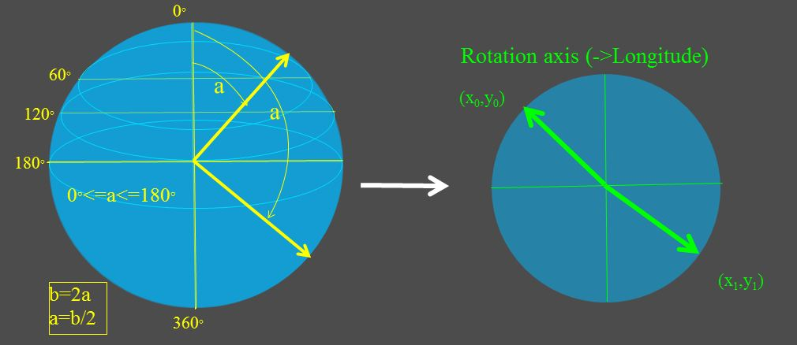

<font size ="5">
<div style="width:900px;height:180px;border:6px outset">

<p align ="left"><font color="#00FFFF">Observations</font></p>
<p align ="left">1. North and south poles -> identity rotation. No axis is defined</p>
<p align ="left">2. Each rotation can be represented as a rotation about some axis, or, equivalently, as a negative rotation about an axis pointing in the opposite direction:<font color="#00FFFF"> antipodal point.</font></p>
<p align ="left">3. The set of rotations<font color="red"> is not closed</font> under composition.</p>
</div>
</font>


##Rotations
<p align ="left"><font size="5">The hypersphere of rotations(<font color="yellow">3D case</font>)</font></p>
<p align ="left"><font color="yellow" size ="5">Rotation angle : $\beta $(->latitude $\alpha$)</font></p>
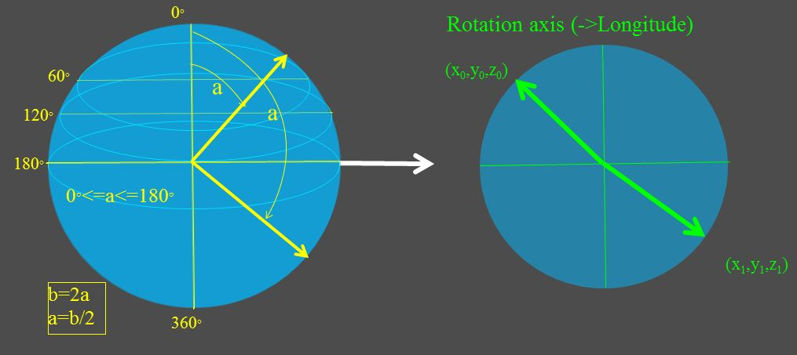

<font size ="5">
<div style="width:900px;height:220px;border:6px outset">

<p align ="left"><font color="#00FFFF">Observations</font></p>
<p align ="left">1. Hypersphere in four dimensional space.</p>
<p align ="left">2. The "latitude" on the hypersphere will be half of the corresponding angle of rotation.</p>
<p align ="left">3. The set of rotations<font color="red"> is closed </font> under composition.</p>

<p align ="left">4. A general quaternion represents a point in 4D,<font color="#2EFE2E"> but constraining it to have unit magnitude yields a three dimensional space equivalent to the surface of a hypersphere.</font></p>
</div>
</font>


##Rotations
<p align ="left"><font size="5">Parameterizing the space of rotations(<font color="yellow">2D case</font>)</font></p>

<font size ="4">
<div style="width:900px;height:100px;border:6px outset">
<p align ="left"><font color="#00FFFF">Problem</font></p>
<p align ="left">1. Latitude and longitude are <font color="red"> degenerated.</font></p>
<p align ="left">2. It can be shown that no two-parameter coordinate system can avoid such degeneracy.</p>
</div>
</font>

<font size ="4">
<div style="width:900px;height:120px;border:6px outset">
<p align ="left"><font color="#00FFFF">Idea</font></p>
<p align ="left">Parameterize the space with three Cartesian coordinates (here <font color="yellow">$w,x,y$</font>)</p>
<p align ="left"><font size ="4"><font color="#2EFE2E">* North pole </font> -> <font color="yellow">$(w,x,y) = (1,0,0)$</fon> <font color="#2EFE2E">* South pole </font> -> <font color="yellow">$(w,x,y) = (−1,0,0)$</font><font color="#2EFE2E">* equator </font> -> <font color="yellow">$w = 0, x2 + y2 = 1$</font></font></p>
<p align ="left"><font size ="4">Points on the sphere satisfy the constraint:<font color="yellow"> $w2 + x2 + y2 = 1.$</font></font></p>
</div>
</font>
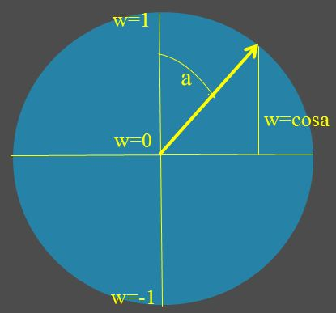

<font size ="4">
<div style="width:500px;height:100px;border:6px outset">
<p align ="left">A point <font color="yellow">$(w,x,y)$</font> on the sphere represents a rotation</p>
<p align ="left"><font color="#2EFE2E">* Horizontal axis</font> directed by the vector <font color="yellow">$(x,y,0)$</font>.</p>
<p align ="left"><font color="#2EFE2E">* Angle </font><font color="yellow">$\beta = 2 \ast cos^{-1} w$</font></p>
</div>
</font>

</br>
<p align ="left"><font size = "5">1.<font color="yellow">$w = cos \alpha$</font>,since<font color="yellow">$\alpha =$$\beta \above 1pt 2$</font>$\rightarrow$<font color="yellow">$w = cos (\beta / 2)$</font>
</font></p>

<p align ="left"><font size = "5">2. Since<font color="yellow">$\space w^2 = cos^2 (\beta / 2)$</font>$\rightarrow$<font color="yellow">$(x^2 + y^2 = sin^2 (\beta / 2))$</font>
</font></p>


##Rotations
<p align ="left"><font size="5">Parameterizing the space of rotations(<font color="yellow">3D case</font>)</font></p>

<font size ="4">
<div style="width:900px;height:100px;border:6px outset">
<p align ="left"><font color="#00FFFF">Problem</font></p>
<p align ="left">1. Latitude and longitude are <font color="red"> degenerated.</font></p>
<p align ="left">2. It can be shown that no two-parameter coordinate system can avoid such degeneracy.</p>
</div>
</font>

<font size ="4">
<div style="width:900px;height:120px;border:6px outset">
<p align ="left"><font color="#00FFFF">Idea</font></p>
<p align ="left">Parameterize the space with four Cartesian coordinates (here <font color="yellow">$w,x,y,z$</font>)</p>

<p align ="left">Points on the hypersphere satisfy the constraint:<font color="yellow">$w^2+x^2+y^2+z^2 = 1$</font></p>
</div>
</font>


<font size ="4">
<div style="width:500px;height:100px;border:6px outset">
<p align ="left">A point <font color="yellow">$(w,x,y,z)$</font> on the sphere represents a rotation</p>
<p align ="left"><font color="#2EFE2E">\ast Axis</font> directed by the vector <font color="yellow">$(x,y,z)$</font>.</p>
<p align ="left"><font color="#2EFE2E">\ast Angle </font><font color="yellow">$\beta = 2 \ast cos^{-1} w$</font></p>
</div>
</font>

</br>
<p align ="left"><font size = "5">1.<font color="yellow">$w = cos \alpha$</font>,since<font color="yellow">$\alpha =$$\beta \above 1pt 2$</font>$\rightarrow$<font color="yellow">$w = cos (\beta / 2)$</font>
</font></p>

<p align ="left"><font size = "5">2. Since<font color="yellow">$\space w^2 = cos^2 (\beta / 2)$</font>$\rightarrow$<font color="yellow">$(x^2 + y^2 + z^2  = sin^2 (\beta / 2))$</font>
</font></p>


##Rotations
<p align ="left"><font size ="5">Rotations and Quaternions</font></p>
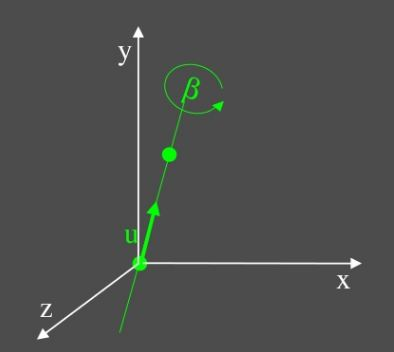
<font size ="5">
<div style="width:400px;height:80px;border:6px outset">
<p align ="left"><font color="#2EFE2E">$u$</font> is a unit vector</p>
<p align ="left"><font color="#2EFE2E">$\beta$</font> is the rotation angle</p>
</div>
</font>

<font size ="5">
<div style="width:500px;height:420px;border:6px outset">
<p align ="left">For the rotation around an axis across the origin</p>
<p align ="left"><font color="#2EFE2E">1.Defined the unit quaternion:</font></p>
<p align ="left"><font color="#2EFE2E">$q =$</font>$(s,$<font color="#00FFFF">$v$</font>$)$ where $s= cos($<font color="#2EFE2E">$\beta$</font>$/2)$</p>
<p align ="left"><font color="#00FFFF">$v=$</font><font color="#2EFE2E">$u$</font>$sin($<font color="#2EFE2E">$\beta$</font>$/2)$</p>

<p align ="left"> The position of any point <font color="yellow">$P$</font>(to turn through this quaternion), it can be represented as:<font color="yellow">$P$</font>$=(0,$<font color="yellow">$p$</font>$)$ </p>

<p align ="left"> With <font color="#2EFE2E">$p$</font>$= (x,y,z)$ (coordinates), we get:<font color="yellow">$P$</font>$=(0,$<font color="yellow">$p$</font>$)$ </p>

<p align ="left"><font color="#2EFE2E">2.</font><font color="yellow">$P'$</font>$=$<font color="#2EFE2E">$q$</font><font color="yellow">$P$</font><font color="#2EFE2E">$q^{-1}$</font>, the rotation point is defined.</p>

<p align ="left">With<font color="#2EFE2E">$\space q^{-1}$</font>$=$<font color="#2EFE2E">$($</font>$s,$<font color="#00FFFF">$-v$</font><font color="#2EFE2E">$)$</font> this is the inverse of<font color="#2EFE2E">$\space q$</font> </p>

</div>
</font>


##Rotations
<p align ="left"><font size ="5">Proof and Properties</font></p>
<font size ="5">
<div style="width:900px;height:150px;border:6px outset">
<p align ="left">Let <font color="#2EFE2E"> $u$ </font>be a unit vector (rotation axis) and<font color="#2EFE2E"> $q$ </font>$=(s,$<font color="#2EFE2E"> $u$ </font><font color="#00FFFF">$v$</font>$= cos($<font color="#2EFE2E">$\beta$</font>$/2)+$<font color="#2EFE2E"> $u$ </font>$sin($<font color="#2EFE2E">$\beta$</font>$/2)$.The goal is to show that:</p>

<p align ="left"><font color="yellow">$(1) P'$</font>$=$ <font color="#2EFE2E">$q$</font><font color="yellow">$P$</font><font color="#2EFE2E">$q^{-1}$</font>$\rightarrow$ yields the vector<font color="yellow"> $P'$</font> upon rotation of the original vector<font color="yellow"> $P$</font> by an angle<font color="#2EFE2E">$\beta$</font> around the axis <font color="#2EFE2E">$u$</font>.</p>
</div>
</font>

<font size ="5">
<div style="width:900px;height:40px;border:6px outset">
<p align ="left"><font color="#2EFE2E">Proof:</font> expand <font color="yellow">(1)</font> to reduce it to <font color="#2EFE2E">rodrigues rotation</font> formula. See next slide.</p>
</div>
</font>

<font size ="5">
<div style="width:900px;height:300px;border:6px outset">
<p align ="left"><font color="#2EFE2E">Important properties</font></p>
<p align ="left">1. <font color="#00FFFF">Quaternion multiplication is composition of rotations</font>, for if <font color="#2EFE2E">$p$</font> and <font color="#2EFE2E">$q$</font> are
quaternions representing rotations, then rotation (conjugation) by <font color="#2EFE2E">$pq$</font> is:
<font color="#2EFE2E">$pq$</font><font color="yellow">$P$</font><font color="#2EFE2E">$(pq)^{-1}$</font> $=$ <font color="#2EFE2E">$pq$</font><font color="yellow">$P$</font><font color="#2EFE2E">$q^{-1}p^{-1}$</font> $=$<font color="#2EFE2E"> $p$</font>$($<font color="#2EFE2E">$q$</font><font color="yellow">$P$</font><font color="#2EFE2E">$q^{-1}$</font>$)$<font color="#2EFE2E">$p^{-1}$</font>
which is the same as rotating (conjugating) by <font color="#2EFE2E">$q$</font> and then by<font color="#2EFE2E"> $p$</font>.</p>
<p align ="left">2. <font color="#00FFFF">The quaternion inverse of a rotation is the opposite rotation</font>, since <font color="#2EFE2E">$q^{-1}$</font>$($<font color="#2EFE2E">$q$</font><font color="yellow">$P$</font><font color="#2EFE2E">$q^{-1}$</font>$)$<font color="#2EFE2E">$q$</font>$ =$ <font color="yellow">$P$</font></p>

<p align ="left">3.<font color="#2EFE2E">$q^n$</font><font color="#00FFFF"> is a rotation by </font><font color="#2EFE2E">$n$</font><font color="#00FFFF"> times the angle around the same axis as </font><font color="#2EFE2E">$q$</font>.</p>
<p align ="left">4. This (3) can be extended to arbitrary real <font color="#2EFE2E"> n</font>, allowing for <font color="#00FFFF">smooth interpolation
between spatial orientations</font>.</p>
</div>
</font>


##Rotations
<p align ="left"><font size ="5">Rodrigues rotation formula</font></p>
<p align ="left"><font size ="5">The following formula rotates <font color="red">$v$</font> around the unit vector<font color="red">$z$</font> by an angle <font color="yellow">$\beta$</font>:</p>
<font size ="5">
<div style="width:510px;height:40px;border:6px outset">
<p align ="left"><font color="blue">$v_{rot}$</font>$=$<font color="red">$v$</font>$cos$<font color="yellow">$\beta$</font>$+($<font color="red">$z$</font>x<font color="red">$v$</font>$)sin$<font color="yellow">$\beta$</font>$+$<font color="red">$z$</font>$($<font color="red">$z$</font>$\bullet$<font color="red">$v$</font>$)(1-cos$<font color="yellow">$\beta$</font>$)$</p>
</div>
</font>
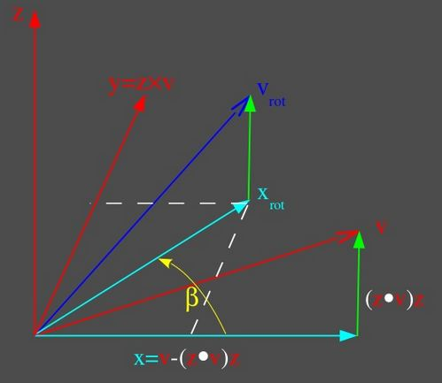
<p align ="left"><font size ="5" color="#2EFE2E">Observation</font></p>
<p align ="left"><font size ="5">Let <font color="yellow">$\phi$</font> be the angle between <font color="red"> $z$</font> and <font color="red">$v$</font>.</font></p>

<p align ="left"><font size ="5"><font color="red">$z$</font>$\bullet$<font color="red"> $v$</font> $=|$<font color="red">$z$</font>$||$<font color="red">$v$</font>$|$</font>$cos$<font color="yellow">$\phi$</font>(1),</p>

<p align ="left"><font size ="5">$|$<font color="red">$z$</font>x<font color="red"> $v$</font> $|=|$<font color="red">$z$</font>$||$<font color="red">$v$</font>$|$</font>$sin$<font color="yellow">$\phi$</font>(2)</p>

<p align ="left"><font size ="5">Since$|$<font color="red">$z$</font>$|=1 \rightarrow$</p>

<p align ="left"><font size ="5">a)$|$<font color="red">$y$</font>$|=|$<font color="red">$v$</font>$|sin$<font color="yellow">$\phi$</font>(from(2))</p>

<p align ="left"><font size ="5">b)<font color="red">$z$</font>$\bullet$<font color="red"> $v$</font> $=|($<font color="red">$z$</font>$\bullet$<font color="red">$v$</font>$)$</font><font color="red">$z$</font>$|=|$<font color="red">$v$</font>$| cos$<font color="yellow">$\phi$</font></p>

<p align ="left"><font size ="5"><font  color="#2EFE2E">Conclusion: </font><font color="#00FFFF">$|x|$</font>$=$</font><font color="red">$|y|$</font></p>

<p align ="left"><font color="#00FFFF">$x_{rot}$</font>$=$<font color="#00FFFF">$x$</font>$cos$</font><font color="yellow">$\beta $</font>$+$<font color="red">$y$</font>$sin$<font color="yellow">$\beta $</font></p>

<p align ="left"><font color="#00FFFF">$x_{rot}$</font>$=($<font color="red">$v$</font>$-($<font color="red">$z$</font>$\bullet$<font color="red">$v$</font>$)$<font color="red">$z$</font>$) cos$<font color="yellow">$\beta $</font>$+($<font color="red">$z$</font>x<font color="red">$v$</font>$) sin$<font color="yellow">$\beta $</font></p>

<p align ="left"><font color="blue">$v_{rot}$</font>$=$<font color="#00FFFF">$xrot$</font>$+($<font color="red">$z$</font>$\bullet$<font color="red">$v$</font>$)$<font color="red">$z$</font></p>


##Rotations
<p align ="left"><font size ="5">Rotations and Quaternions</font></p>
<table width="350" heigth="500" border="0" align ="right">
<tr>
<td>

</td>
</tr>
<tr>
<td>
<p align ="left"><font size ="5">Consider the traslation:</font></p>
</td>
</tr>
<tr>
<td>
<font size ="5">
<div style="width:400px;height:40px;border:6px outset">
<p align ="left">$R($<font color="#2EFE2E">$\beta$</font>$)=$<font color="yellow">$T^{-1}$</font>$\bullet M_R($<font color="#2EFE2E">$\beta$</font>$) \bullet$<font color="yellow">$T$</font></p>
</div>
</font>
</td>
</tr>
<tr>
<td>
<p align ="left"><font size ="5">We got before:</font></p>
</td>
</tr>
</table>

<font size ="5">
<div style="width:400px;height:200px;border:6px outset">
<p align ="left"><font color="#2EFE2E">$u$</font> is a unit vector</p>
<p align ="left"><font color="#2EFE2E">$\beta$</font> is the rotation angle</p>
<p align ="left"><font color="#2EFE2E">$q =$</font>$(s,$<font color="#00FFFF">$v$</font>$)$ ,with $s= cos($<font color="#2EFE2E">$\beta$</font>$/2)$</p>
<p align ="left"><font color="#00FFFF">$v=$</font><font color="#2EFE2E">$u$</font>$sin($<font color="#2EFE2E">$\beta$</font>$/2)$</p>
<p align ="left"><font color="#2EFE2E">$q^{-1}$</font>$=$<font color="#2EFE2E">$($</font>$s,$<font color="#00FFFF">$-v$</font><font color="#2EFE2E">$)$</font><font color="#2EFE2E">$\space \space p$</font>$= (x,y,z)$</p>
</div>
</font>

<font size ="5">
<div style="width:500px;height:120px;border:6px outset">
<p align ="left"><font color="#2EFE2E">$P'$</font>$=$<font color="#2EFE2E">$qPq^{-1}$</font>$=$<font color="#2EFE2E">$($</font>$0,$<font color="#2EFE2E">$p')$</font></p>

<p align ="left"><font color="#2EFE2E">$p'$</font>$= s^2$<font color="#2EFE2E">$p$</font>$+$<font color="#00FFFF">$v$</font>$($<font color="#2EFE2E">$p$</font>$\bullet$<font color="#00FFFF">$v$</font>$) + 2s($<font color="#00FFFF">$v$</font>x<font color="#2EFE2E">$p$</font>$)+$<font color="#00FFFF">$v$</font>x$($<font color="#00FFFF">$v$</font>x<font color="#2EFE2E">$p$</font>$)$</p>

<p align ="left">Taking <font color="#00FFFF">$v= (a,b,c)$</font>we get:</p>
</div>
</font>

<font size = 3>
<p align ="left">
$M_R(\beta)=\begin{bmatrix} 
1-2b^2-2c^2 & 2ab-2sc & 2ac+2sb & 0  \cr
2ab+2sc & 1-2a^2-2c^2 & 2bc-2sa & 0 \cr
2ac-2sb & 2bc+2sa & 1-sa^2-2b^2 & 0 \cr 
0 & 0 & 0 & 1 \end{bmatrix}
$
</p> 
</font>

</br>
<font size ="5">
<div style="width:800px;height:40px;border:6px outset">
<p>$R($<font color="#2EFE2E">$\beta$</font>$)=$<font color="yellow">$T^{-1}$</font>$\bullet R_x($<font color="#2EFE2E">$\alpha$</font>$)^{-1} \bullet R_y($<font color="#2EFE2E">$\lambda$</font>$)^{-1} \bullet R_z($<font color="#2EFE2E">$\beta$</font>$) \bullet R_y ($<font color="#2EFE2E">$\lambda$</font>$) \bullet R_x($<font color="#2EFE2E">$\alpha$</font>$) \bullet$<font color="yellow">$T$</font></p>
</div>
</font>


##Shear 
<p align ="left">Three-dimensional<font color="#2EFE2E">/ respect to z-axis</font></p>
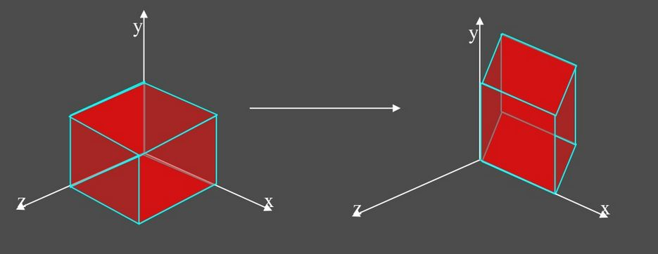
<table width="800" heigth="500" border="0">
<tr>
<td>
<font size = 5>
$D_z=\begin{bmatrix} 
1 & 0 & a & 0  \cr
0 & 1 & b & 0 \cr
0 & 0 & 1 & 0 \cr 
0 & 0 & 0 & 1 \end{bmatrix}
\space \space \space 
$
</font>
</td>
<td>
<font size = 5>
<div style="width:400px;height:150px;border:6px outset red">
<p align ="left">Thus:</p>
<p align ="left"><font color="#2EFE2E">$x'$</font>$= x +$<font color="red">$a$</font>$\ast z$</p>
<p align ="left"><font color="#2EFE2E">$y'$</font>$= y +$<font color="red">$b$</font>$\ast z$</p>
<p align ="left"><font color="#2EFE2E">$z'$</font>$= z$</p>
</div>
</font>
</td>
</tr>
</table>


##Modeling Transformations
<p align ="left">World and local coordinates systems</P>
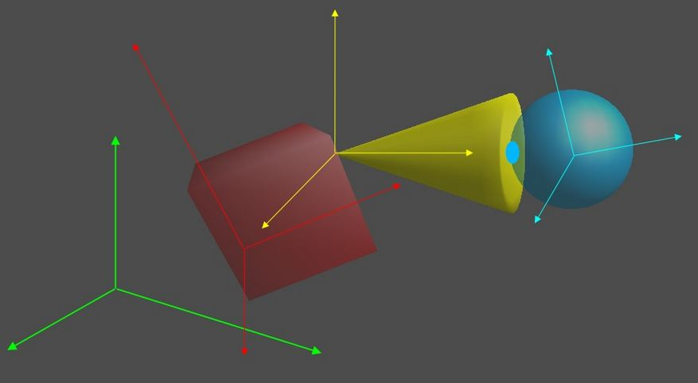


##Modeling Transformations
<p align ="left">Transformations between coordinates systems</P>
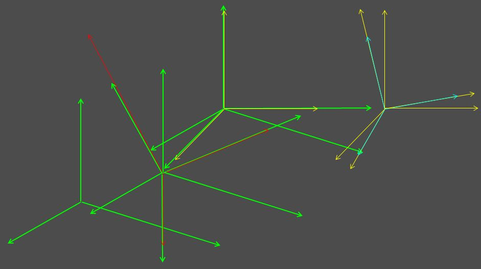
<p align ="left"><font color="#2EFE2E">Note:</font>Transformations between systems may involve till three consecutive rotations</p>


##Modeling Transformations
<p align ="left">Transformations between coordinates systems/ Hierarchy(Graph)</P>
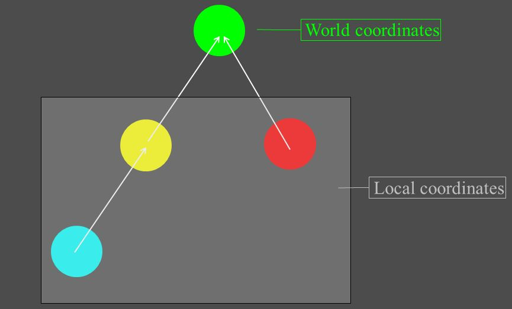


##Modeling Transformations
<p align ="left"><font size ="5">Transformations between coordinates systems/ Orthogonal Matrix method</font></p>
<p align ="left"><font size ="5">Coordinate transformation involve 1 traslation and 3 rotations: $\space R \bullet$<font color ="yellow"> $T$</font></font></p>
<p align ="left"><font size ="5">Alternative way to calculate the composed rotation matrix: $R$</font></p>


<font size ="5">
<div style="width:400px;height:120px;border:6px outset">
<p align ="left"><font color="#00FFFF">$u_x'$</font>$=$(<font color="#00FFFF">$u_x'1,u_x'2,u_x'3$</font>)</p>
<p align ="left"><font color="red">$u_y'$</font>$=$(<font color="red">$u_y'1,u_y'2,u_y'3$</font>)</p>
<p align ="left"><font color="yellow">$u_x'$</font>$=$(<font color="yellow">$u_z'1,u_z'2,u_z'3$</font>)</p>
</div>
</font>
</br>
</br>
<font size = 5>
$R=\begin{bmatrix} 
u_x'1 & u_x'2 & u_x'3 & 0  \cr
u_y'1 & u_y'2 & u_y'3 & 0 \cr
u_z'1 & u_z'1 & u_z'1 & 0 \cr 
0 & 0 & 0 & 1 \end{bmatrix}
$ 
</font>


##Modeling Transformations
<p align ="left"><font size ="5">OpenGL Example</font></p>
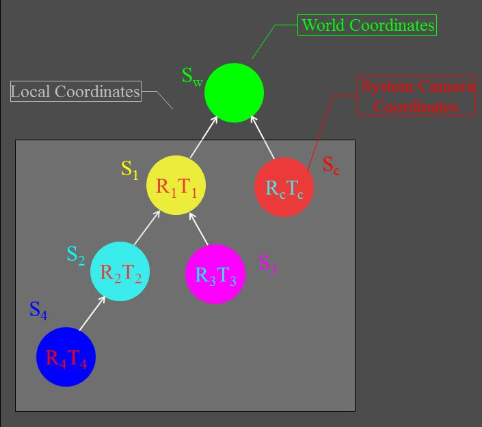
<font size ="5">
<div style="width:500px;height:200px;border:6px outset">
<p align ="left">$R_1T_1:$<font color="yellow">$S_1$</font>$\rightarrow$<font color="#2EFE2E">$S_w$</font>translate and rotate<font color="#2EFE2E">$S_w$</font>$\rightarrow$<font color="yellow">$S_1$</font></p>

<p align ="left">$R_2T_2:$<font color="#00FFFF">$S_2$</font>$\rightarrow$<font color="yellow">$S_1$</font>translate and rotate<font color="yellow">$S_1$</font>$\rightarrow$<font color="#00FFFF">$S_2$</font></p>

<p align ="left">$R_3T_3:$<font color="#8904B1">$S_3$</font>$\rightarrow$<font color="yellow">$S_1$</font>translate and rotate<font color="#8904B1">$S_3$</font>$\rightarrow$<font color="yellow">$S_1$</font></p>

<p align ="left">$R_4T_4:$<font color="blue">$S_4$</font>$\rightarrow$<font color="#00FFFF">$S_2$</font>translate and rotate<font color="#00FFFF">$S_2$</font>$\rightarrow$<font color="blue">$S_4$</font></p>

<p align ="left">$R_cT_c:$<font color="red">$S_c$</font>$\rightarrow$<font color="#2EFE2E">$S_w$</font>translate and rotate<font color="#2EFE2E">$S_w$</font>$\rightarrow$<font color="red">$S_c$</font></p>

</div>
</font>


##Modeling Transformations
<p align ="left"><font size ="5">OpenGL Example</font></p>
<p align ="left"><font size ="5"><font color="#2EFE2E">OpenGL matrix stack (model-view)</font></font></p>
<p align ="left"><font size ="5"><font color="#00FFFF">pushMatrix:</font> multiply current matrix and adds to the head</font></p>
<p align ="left"><font size ="5"><font color="red">popMatrix:</font> remove head</font></p>


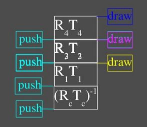


